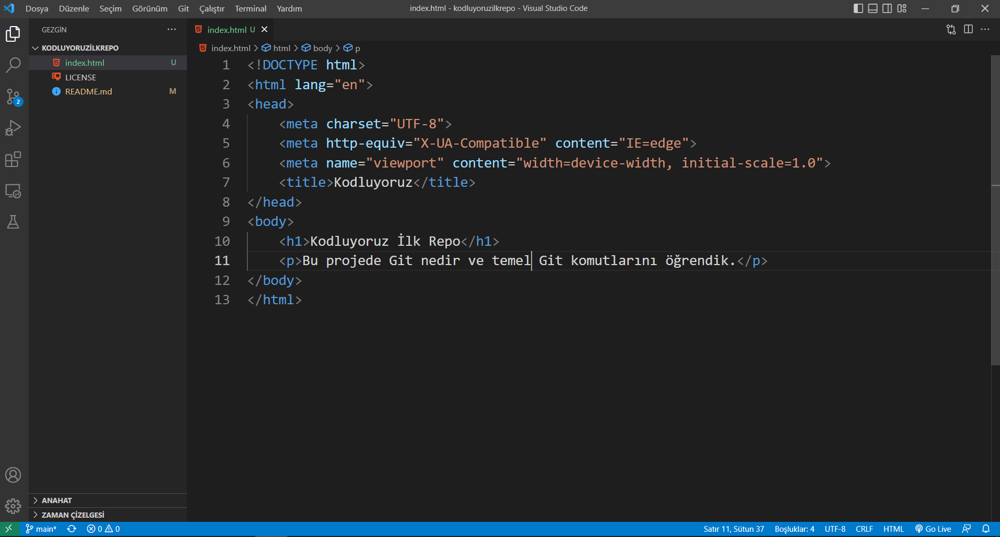

# kodluyoruzilkrepo
Bu repo [Kodluyoruz](https://kodluyoruz.org/tr/kodluyoruz/) Eğitimi kapsamında açtığım ilk repo, içerisinde bir adet README dosyası, bir adet de index.html barındırıyor.

# Installation
Öncelikle projeyi clonelayın.
```bash
https://github.com/efeturkemir/kodluyoruzilkrepo.git
```
# Usage
Projeyi clonladıktan sonra Visual Studio Code programında açınız.
Linux için:
```bash
cd kodluyoruzilkrepo
code .
```

# Contributing
Pull requestler kabul edilir. Büyük değişiklikler için, lütfen önce neyi değiştirmek istediğinizi tartışmak için bir konu açınız.

# Licence
[MIT](https://choosealicense.com/licenses/mit/)


